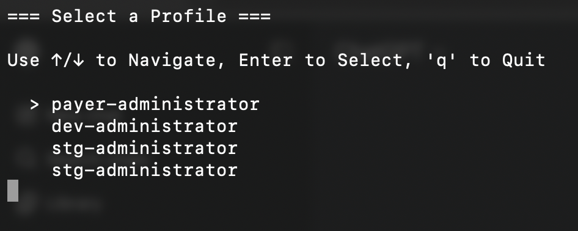

# AWS Auth

## Motivation

AWS DevOps administrators commonly manage multiple accounts across different environments (development, staging, and production). While all profile configurations are stored in **~/.aws/config**, switching between accounts using the AWS CLI `--profile` argument for every command can be tedious and error-prone. For example: `aws s3 ls --profile dev-account`

Additionally, many tools and applications require AWS credentials to be available as environment variables (such as `AWS_ACCESS_KEY_ID`, `AWS_SECRET_ACCESS_KEY`, `AWS_SESSION_TOKEN`, etc.) rather than relying on AWS CLI profile configurations. The AWS CLI doesn't automatically export these environment variables, which creates friction when working with tools that expect them.

This project simplifies the authentication workflow by providing a streamlined way to authenticate and automatically export the necessary environment variables, making it easier to switch between AWS accounts and work with various AWS tools seamlessly.

## Why SSO Authentication?

Authentication via SSO (AWS IAM Identity Center, formerly AWS SSO) is a centralized and simplified way to access multiple AWS accounts and applications using a single corporate login.

### Key Benefits

- **Single sign-on:** no need to manage multiple passwords or keys for each AWS account.

- **Centralized control:** permissions defined in one place and automatically applied across AWS accounts.

- **Enhanced security:** native support for MFA (multi-factor authentication).

- **Simplified CLI and console experience:** access through aws sso login and profiles configured in ~/.aws/config.

## How to Configure

### Requirements(Unix/Bash)

- [AWS CLI](https://docs.aws.amazon.com/cli/latest/userguide/getting-started-install.html)
- [JQ](https://jqlang.github.io/jq/download/)
- [Docker](https://docs.docker.com/engine/install/)
- [Helm](https://helm.sh/docs/intro/install/)

### Setup

1 - Create the AWS folder exists

```bash
mkdir ~/.aws
```

2 - Configure the **~/.aws/config** file

2.1 - Create the file

```bash
touch ~/.aws/config
```

2.2 - Create the **~/.aws/config** content

```conf
##### SSO Credentials Configuration #####
#### General Session ####
[sso-session #{IAM_IDENTITY_NICKNAME}]
sso_start_url = #{IAM_IDENTITY_START_URL}¹
sso_region = #{IAM_IDENTITY_REGION}²
sso_registration_scopes = #{IAM_IDENTITY_ACCOUNT_NUMBER}
#### General Session ####

############################################################

### Account ###
## Profiles ##
[profile #{TARGET_ACCOUNT_NICKNAME}³]
sso_session = #{TARGET_ACCOUNT_NICKNAME}³
sso_account_id = #{TARGET_ACCOUNT_ID}⁴
sso_role_name = #{TARGET_ACCOUNT_ROLE}
region = #{TARGET_ACCOUNT_REGION}
output = json
## Profiles ##

## Sessions ##
[sso-session #{TARGET_ACCOUNT_NICKNAME}³]
sso_start_url = #{IAM_IDENTITY_START_URL}¹
sso_region = #{IAM_IDENTITY_REGION}²
sso_registration_scopes = #{TARGET_ACCOUNT_ID}⁴
## Sessions ##
### Account ###
```

2.3 - You can optionally configure your access by generating the **~/.aws/config** file using the [AWS CLI](https://docs.aws.amazon.com/cli/latest/userguide/cli-configure-sso.html).

## Install

```bash
mkdir $HOME/sso && \
curl --output $HOME/sso/aws-sso.sh "https://raw.githubusercontent.com/marquesmateus93/aws-auth/refs/heads/master/sso/aws-sso.sh" && \
curl --output $HOME/sso/read-aws-config.sh "https://raw.githubusercontent.com/marquesmateus93/aws-auth/refs/heads/master/sso/read-aws-config.sh" && \
chmod -R +x $HOME/sso && \
echo 'alias sso-aws="source $HOME/sso/aws-sso.sh"' >> $HOME/.bash_profile && \
source ~/.bash_profile
```

## How to Use

1 - Invoke the `aws-sso` authenticator

```bash
aws-sso
```

2 - Choose the profile



3 - Choose the region(**default:** us-east-2)


4 - Then you will be redirected to the browser for authentication allowance

5 - If everything goes right, you might see the secessful prompt

